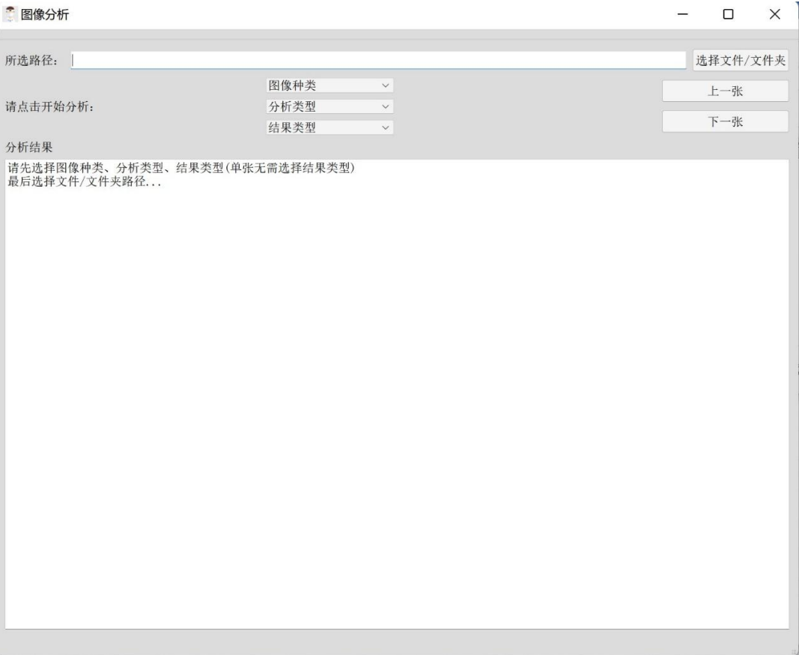
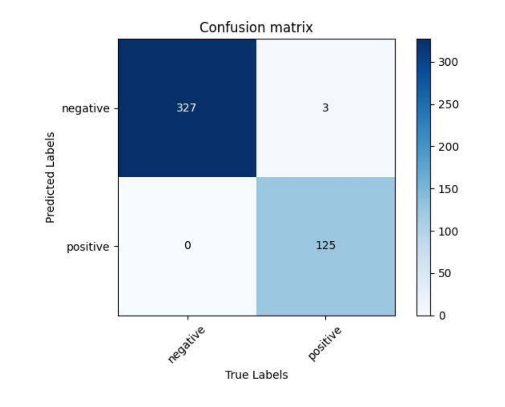
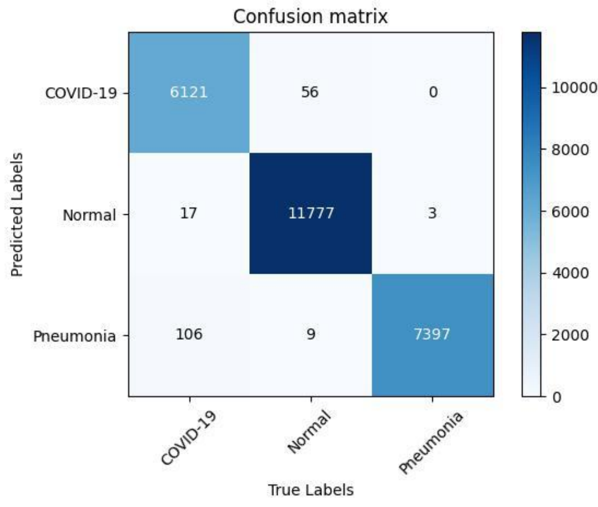

### 基于pytorch的QT制作的胸部CT，X-ray分类阅片系统
初次接触深度学习时制作，分类训练代码找不到了(应该是来自bilibli教程:thinking:)。  
系统具有瑕疵，容错性低，图像通道会差异导致系统直接闪退，此处热力图是个大坑。  
时隔太久不再进行修改上传以做纪念。  
感谢my best teammate cc的支持与陪伴:grinning:。
### 系统与模型展示
(原图找不到了:sob:，截取自作品文档pdf)  

X-ray二分类预测，验证集混淆矩阵。  

CT三分类预测，验证集混淆矩阵。

乍一看准确率很高，医学图像数据样本较为简单，不排除过拟合了	:joy:。  
X-ray数据集来自  
https://www.kaggle.com/datasets/scipygaurav/covid19-chest-xray-dataset-augmented-80
CT数据集来自  
https://www.kaggle.com/datasets/hgunraj/covidxct
### 系统运行
系统`System`文件作为根目录，还需要新建两个目录`./NET50` `./2CData`，其中`./NET50` 模型权重从该目录中获取，`./2CData` 系统运行时使用。  
可执行程序文件与模型权重上传Google硬盘:  
https://drive.google.com/drive/folders/1OMZh_Q0QAcLMAY9qe0S_fW6KEyCx-HHd?usp=share_link  
目录结构如下：
```
System
│   class2_indices.json
│   class3_indices.json 
│   main.exe
|   图标.ico
└───NET50
│   │   ResNet50_32_2.pth
│   └   ResNet50_64_3.pth 
└───2CData
```
准备就绪后`main.exe` 可直接运行。  
其中模型使用到了ResNet50预训练模型权重：  
https://download.pytorch.org/models/resnet50-19c8e357.pth  
源码`Source code` 目录下包含当前系统制作所编写的代码，包含热力图绘制，混淆举证的绘制，系统编写等。
